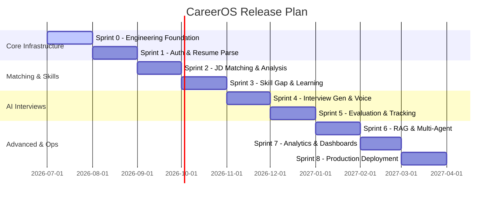

# CareerOS

CareerOS is a production-grade AI-powered Career Copilot designed to help professionals navigate and optimize their career journeys. It acts as an intelligent assistant that parses resumes, analyzes job descriptions, identifies skill gaps, creates personalized learning pathways, and provides simulated voice/text interview coaching with automated AI evaluation.

---

## Project Vision

The long-term roadmap for CareerOS includes the following capability layers, which will be introduced incrementally:

*   **Secure Core:** Secure authentication and profile management.
*   **Resume Intelligence:** Resume parsing and structured content extraction.
*   **Market Analysis:** Job description parsing and matching algorithms.
*   **Skill Optimization:** Gap analysis and personalized learning plans.
*   **Interview Coaching:** Interactive text and voice-based mock interviews with automated AI feedback.
*   **Advanced AI Workflows:** Retrieval-Augmented Generation (RAG) and collaborative multi-agent setups.
*   **Analytics & Reporting:** Rich metrics for users and an administrative dashboard.

---

## Tech Stack

### Backend Service
*   **Language:** Python 3.12+
*   **API Framework:** FastAPI
*   **Database:** PostgreSQL
*   **ORM:** SQLAlchemy 2.0
*   **Database Migrations:** Alembic
*   **Configuration Management:** Pydantic Settings
*   **Package Manager:** uv
*   **Code Quality:** Ruff (linting/formatting), pytest (testing)
*   **Containerization:** Docker

### GenAI & Infrastructure (Planned)
*   **Local LLM Execution:** Ollama
*   **Agentic Workflows:** LangGraph
*   **Caching & Session Management:** Redis
*   **Vector Search:** Qdrant
*   **Observability:** Prometheus & Grafana

---

## Directory Structure

```text
CareerOS/
├── .github/                  # GitHub configurations and templates
│   ├── workflows/            # CI/CD pipeline definitions
│   └── ISSUE_TEMPLATE/       # Automated issue templates
├── backend/                  # Python backend application
│   ├── alembic/              # Database migration scripts
│   ├── app/                  # Main application source code
│   │   ├── api/              # API endpoints and routers
│   │   ├── common/           # Shared helpers and utility code
│   │   ├── config/           # Pydantic settings and configuration
│   │   ├── core/             # Core server logic (security, server lifecycle)
│   │   ├── database/         # Database connection and session management
│   │   └── main.py           # Application entrypoint
│   ├── tests/                # Test suite (unit and integration tests)
│   └── pyproject.toml        # Backend dependencies and tool configurations
├── docker/                   # Custom Dockerfiles and local service setups
├── docs/                     # Project documentation
│   ├── adr/                  # Architectural Decision Records (ADRs)
│   ├── architecture/         # System design diagrams and specs
│   ├── api/                  # API contracts and specifications
│   ├── development/          # Setup guides and code standards
│   └── deployment/           # Production deployment plans
├── scripts/                  # Utility and orchestration scripts
├── .env.example              # Example environment variables
├── .gitignore                # Git untracked patterns
├── docker-compose.yml        # Development infrastructure setup
├── LICENSE                   # Software license (MIT)
└── README.md                 # Project README
```

---

## Development Roadmap



---

## Sprint Status

### Sprint 0: Engineering Foundation (Current)
*   **Goal:** Establish clean repository layout, configure local database services, set up documentation templates, and define initial dependency management systems.
*   **Status:** In Progress (Repository Structure Setup)
